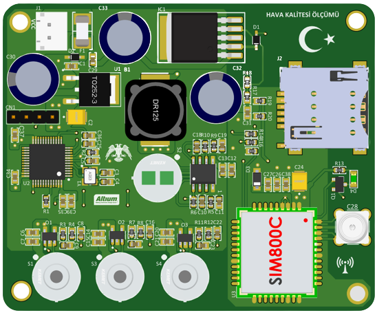
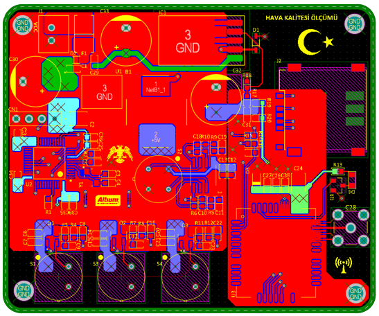

# Hava Kalitesi Ölçümü

Hava Kalitesi Ölçümü kartı, bir döner kanatlı insansız hava aracı için hava kalitesi ölçmek için tasarlanmıştır. Bu kart ile SO2,
NO2, CO ve CO2 gazlarının ölçümü yapılmaktadır.

- 7-12V ile beslenmekte ve 5V ve 3.3V güç çıkışı bulunmaktadır.
- Güç girişin ters bağlanmasına karşı diyot, kısa devrelere karşı uygun değerde sigorta kullanılmıştır.
- İşlemci olarak STM32F103C8T6 kullanılmaktadır.
- Gaz sensörü seçiminde KEMET marka ürünün TO39 paketli ürün grubu kullanılmıştır.
- Haberleşme için SIM800C GSM/GPRS modülü kullanılmıştır.
- Pcb kartı 4 katmanlı ve 73x60 mm boyutundadır.
 
 

  
  
